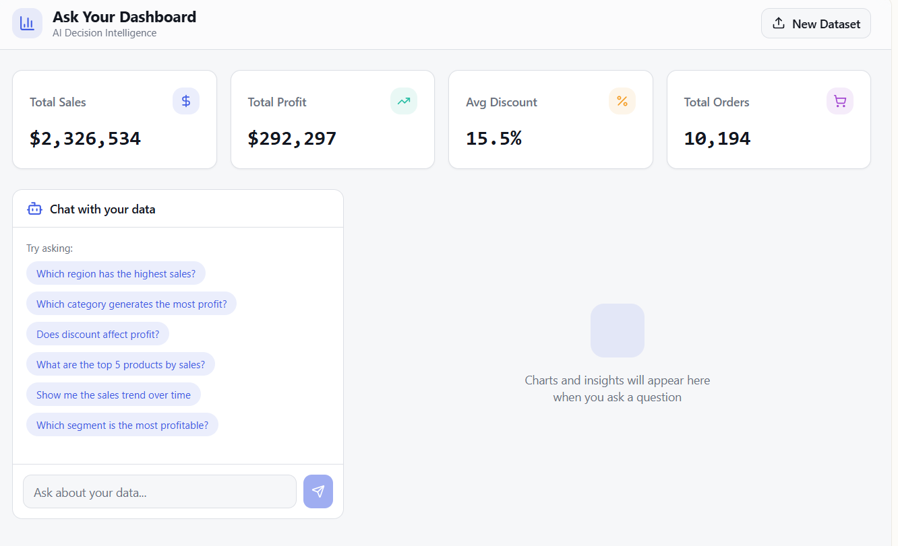
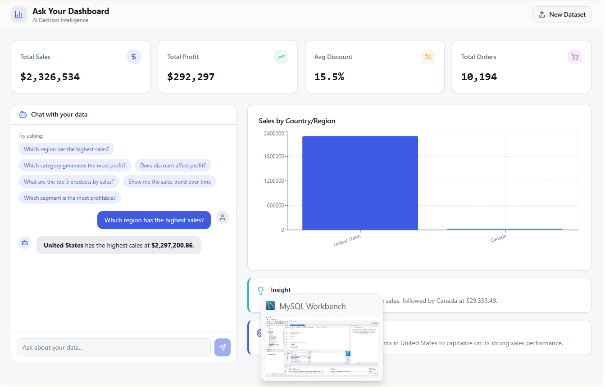
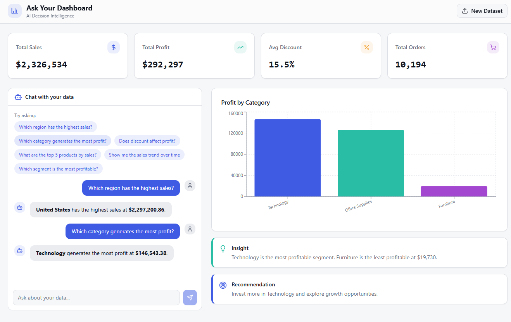
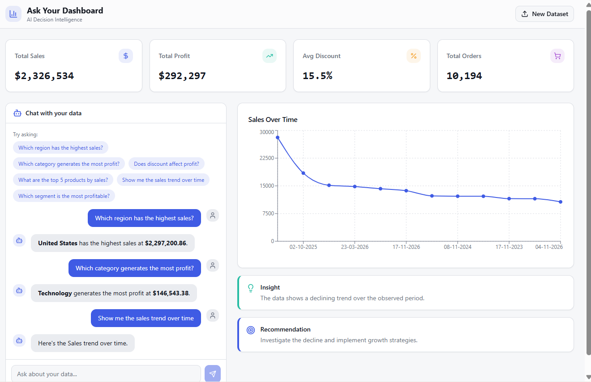

# Ask Your Dashboard – AI Decision Intelligence Assistant

## Overview
This project demonstrates how conversational AI can simplify business analytics by allowing users to ask questions directly to their data.

Instead of manually exploring dashboards, users can upload a dataset and interact with it using natural language queries. The system analyzes the data, generates visualizations, and provides insights to support decision-making.

This project was prototyped using Lovable, an AI-powered app builder, to explore conversational analytics and decision-support dashboards.

## Live Demo

Try the dashboard here:  
https://lovable.dev/projects/59733d83-c9e1-4b58-8ca8-0d35562bc210

## Key Features
- Dataset upload and automatic KPI generation
- Conversational data analysis
- Automated visualizations
- Insight explanations and business recommendations

## Tools & Technologies
- Lovable
- Conversational AI interface
- CSV dataset analytics

## Project Demo

### Dashboard Overview

### Sales by Region

### Profit by Category

### Sales Trend

## Tech Stack

- Python
- Streamlit
- Pandas
- Plotly
- Natural Language Query Interface

## Learning Outcomes
- Building conversational analytics tools
- Automating insight generation
- Designing AI-powered dashboards

  ## Business Questions This Dashboard Answers

- Which region generates the highest sales?
- Which product categories are most profitable?
- How are sales trending over time?
- Which segments contribute the most revenue?
- Where should the business focus to improve profit?

  ## Dataset

This project uses the Superstore dataset commonly used for analytics and dashboard projects.

Fields include:
- Order Date
- Region
- Category
- Sales
- Profit
- Segment

## Project Structure

ask-your-dashboard-ai
│
├── app.py
├── dataset.csv
├── requirements.txt
├── README.md
└── screenshots
    ├── dashboard.png
    ├── region-sales.png
    ├── category-profit.png
    └── sales-trend.png
